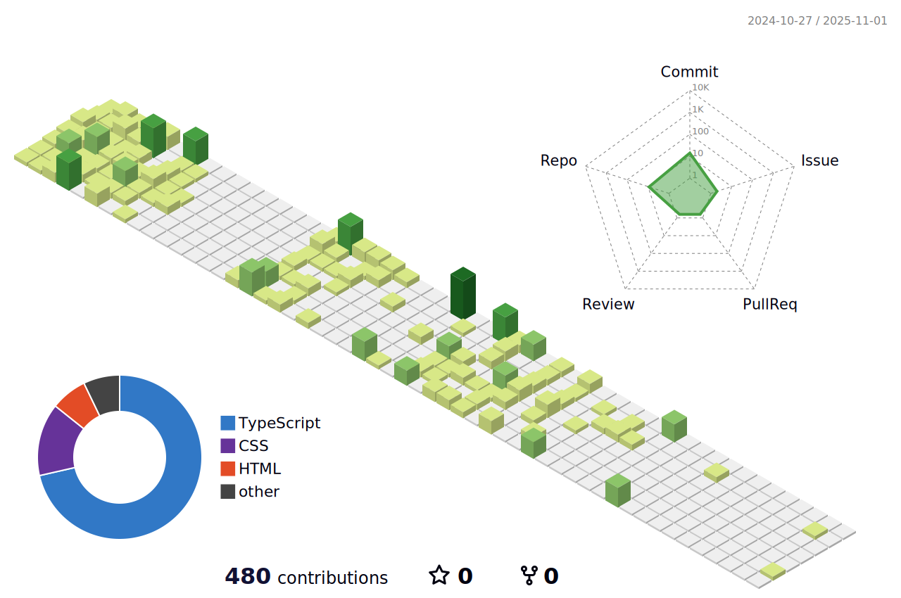

## Hey 👋, I'm Phong Binh Tran!  
  

  
  

I'm a back-end developer   
  

   

## Something about me! 👋
<table><tr><td valign="top" width="50%">

- 🔭 I’m currently working with [Golang](https://go.dev/) & I want to become a "full-snack" developer  
  

- 🌱 I’m currently learning Devops  
  

- ⚡ Fun fact: I use this [web](https://profilinator.rishav.dev/) to generate my readme.md file  

</td><td valign="top" width="50%">

  

</td></tr></table>  

   

## Skills 💻
<table><tr><td valign="top" width="50%">

<h3 style="color:blue;">Languages and Tools 🛠 </h3>

  
  
  
  
  
   
  
  
  
  
  
  
  

 
  
  
  
  
  
  
  
  

  

</td><td valign="top" width="50%">

 

</td></tr></table>  

 

      

